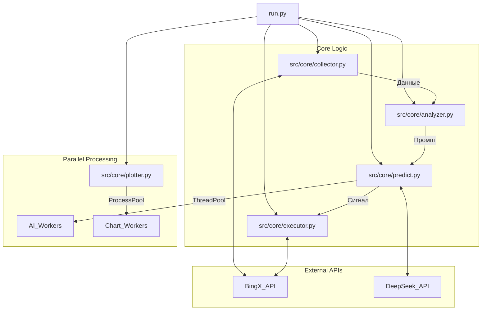

# 🤖 OpenProducer - AI-Powered Algorithmic Trading System


**OpenProducer** - это профессиональная автоматизированная торговая система, разработанная для торговли криптовалютными фьючерсами на бирже **BingX** (Standard & VST Futures).

Система использует передовые модели искусственного интеллекта (**DeepSeek AI**) для принятия торговых решений, комбинируя классический технический анализ с анализом рыночной структуры, психологии толпы и управлением рисками.

---

## 📑 Содержание

1. [⚠️ Важное предупреждение](#-важное-предупреждение)
2. [🚀 Ключевые возможности](#-ключевые-возможности)
3. [🧠 Торговая стратегия и AI](#-торговая-стратегия-и-ai)
4. [⚙️ Установка и Настройка](#-установка-и-настройка)
5. [🔧 Конфигурация (bot_config.json)](#-конфигурация-bot_configjson)
6. [🏗️ Архитектура системы](#-архитектура-системы)
7. [📊 Мониторинг и Логи](#-мониторинг-и-логи)
8. [❓ Устранение неполадок](#-устранение-неполадок)

---

## ⚠️ Важное предупреждение

> [!CAUTION]
> **Торговля фьючерсами связана с экстремально высоким риском потери капитала.**
>
> Данное программное обеспечение предоставляется **"КАК ЕСТЬ"** в образовательных целях. Автор не несет ответственности за любые финансовые потери, понесенные в результате использования данного бота.
>
> 1. **ВСЕГДА** начинайте с демо-счета (BingX VST Futures).
> 2. **НИКОГДА** не торгуйте на деньги, которые не можете позволить себе потерять.
> 3. **НЕ ОСТАВЛЯЙТЕ** бота без присмотра на реальном счете на длительное время.

---

## 🚀 Ключевые возможности

### � Интеллектуальный анализ
*   **DeepSeek Integration**: Использует мощную языковую модель для анализа рыночного контекста, а не просто индикаторов.
*   **Психология рынка**: Оценивает, кто контролирует рынок (быки/медведи), ищет признаки "ловушек" и панических продаж.
*   **Smart Skip**: Пропускает очевидно нейтральные рынки (флэт), экономя API токены и снижая шум.

### ⚡ Высокая производительность
*   **Multi-threading**: Параллельный анализ десятков пар одновременно.
*   **Multi-processing**: Генерация графиков в отдельных процессах, не блокируя торговое ядро.

### 📊 Продвинутая Визуализация
*   **Custom Time Ranges**: Генерация графиков за любой период (1h, 4h, 1D, 1W) с автоматической адаптацией ширины и оси времени.
*   **Smart Indicators**: Корректный расчет SMA и RSI на полном наборе данных, даже для коротких таймфреймов (исключает "плоские" линии).
*   **High-Res Charts**: Детальные свечные графики с наложением индикаторов и торговых уровней.

### 🛡️ Продвинутый Риск-менеджмент
*   **Dynamic SL/TP**: ИИ автоматически рассчитывает уровни Stop Loss и Take Profit на основе локальных уровней поддержки/сопротивления.
*   **Risk/Reward Protection**: Бот **автоматически отклоняет** любые сделки, где потенциальная прибыль меньше риска (R/R < 1.5).
*   **Auto-Close**: Принудительное закрытие позиций по таймеру (по умолчанию 60 мин) для предотвращения "зависания" в сделках.

### 📈 Гибкие режимы торговли
*   **Conservative Mode**: Вход только при сильных сигналах перекупленности/перепроданности (RSI < 30 / > 70).
*   **Aggressive Mode**: Умный вход на откатах по тренду (Trend Pullbacks), даже если индикаторы в нейтральной зоне.

---

## 🧠 Торговая стратегия и AI

Бот работает по следующему алгоритму принятия решений:

### 1. Сбор данных
Система загружает последние 50 свечей (5m таймфрейм) для каждого актива из списка.

### 2. Технический пре-фильтр
Перед вызовом дорогостоящего ИИ, бот проверяет базовые условия:
*   **RSI Filter**: Если RSI между 40 и 60 (нейтральная зона) И нет явного тренда -> **SKIP** (Auto-HOLD).
*   **Trend Filter**: Если включен `AGGRESSIVE_MODE`, бот проверяет положение цены относительно SMA.

### 3. AI Анализ (DeepSeek)
Если пре-фильтр пройден, формируется сложный промпт для ИИ, включающий:
*   Цену, SMA, RSI.
*   Уровни поддержки и сопротивления (вычисляются алгоритмически).
*   Анализ объемов (Volume Profile).
*   Текущую позицию (если есть).

**Задача ИИ**:
1.  Определить структуру рынка.
2.  Найти точку входа.
3.  Рассчитать SL и TP.
4.  Вернуть JSON с решением (`buy`, `sell`, `hold`, `close`).

### 4. Валидация сигнала
Полученный от ИИ сигнал проходит жесткую проверку:
*   Есть ли SL и TP?
*   `Reward = |Price - TP|`
*   `Risk = |Price - SL|`
*   Если `Reward / Risk < 1.5` -> **СИГНАЛ ОТКЛОНЯЕТСЯ**.

---

## ⚙️ Установка и Настройка

### Предварительные требования
*   **OS**: Linux (рекомендуется), macOS, Windows (через WSL).
*   **Python**: Версия 3.12 или выше.
*   **Аккаунт BingX**: Для торговли (Standard Futures).

### Пошаговая установка

1.  **Клонируйте репозиторий:**
    ```bash
    git clone https://github.com/xierongchuan/OpenProducer.git
    cd OpenProducer
    ```

2.  **Создайте виртуальное окружение (рекомендуется):**
    ```bash
    python3 -m venv venv
    source venv/bin/activate
    ```

3.  **Установите зависимости:**
    ```bash
    pip install -r requirements.txt
    ```

4.  **Настройте переменные окружения:**
    Создайте файл `.env` в корне проекта:
    ```bash
    touch .env
    ```
    Добавьте в него ваши ключи:
    ```ini
    # BingX API (Standard Futures)
    BINGX_API_KEY="ваш_публичный_ключ"
    BINGX_SECRET_KEY="ваш_секретный_ключ"

    # DeepSeek API (для мозга бота)
    DEEPSEEK_API_KEY="ваш_ключ_deepseek"
    # ИЛИ SiliconFlow API (альтернативный провайдер)
    SILICONFLOW_API_KEY="ваш_ключ_siliconflow"

    # Режим работы
    # "demo" = VST Futures (Виртуальные деньги BingX)
    # "real" = USDT Standard Futures (Реальные деньги)
    MODE="demo"
    ```

5.  **Запустите бота:**
    ```bash
    python3 run.py
    ```

6.  **Генерация графиков вручную (опционально):**
    Вы можете сгенерировать графики для любого таймфрейма, не запуская весь бот:
    ```bash
    # Графики за последние 2 часа
    python3 src/core/plotter.py 2H

    # Графики за 1 день
    python3 src/core/plotter.py 1D
    ```

---

## 🔧 Конфигурация (`bot_config.json`)

Файл `bot_config.json` позволяет тонко настроить поведение бота без изменения кода.

```json
{
  "EXCHANGE_SYMBOLS": {
    "bingx": ["BTC-USDT", "ETH-USDT", "SOL-USDT", "BNB-USDT", "XRP-USDT"]
  },
  "ENABLE_PARALLEL_PROCESSING": true,
  "AGGRESSIVE_MODE": false,
  "ENABLE_ADVANCED_ANALYSIS": true,
  "MIN_RISK_REWARD_RATIO": 1.5,
  "POSITION_SIZE_PERCENT": 5.0,
  "LEVERAGE": 5,
  "DEFAULT_HOLD_TIME_MINUTES": 60,
  "AI_THRESHOLDS": {
    "RSI_OVERSOLD": 30,
    "RSI_OVERBOUGHT": 70,
    "SMA_PERIOD": 20,
    "RSI_PERIOD": 14
  },
  "DEFAULT_PLOTTER_RANGE": "2H",
  "PLOTTER_RANGES": {
    "2H": { "hours": 2, "interval": "1m" },
    "1D": { "days": 1, "interval": "5m" }
  }
}
```

### Подробное описание параметров

| Параметр | Тип | Описание | Рекомендация |
| :--- | :--- | :--- | :--- |
| `EXCHANGE_SYMBOLS` | Dict | Список пар для торговли. Должны соответствовать тикерам BingX Standard Futures. | Топ-10 ликвидных монет |
| `ENABLE_PARALLEL_PROCESSING` | Bool | **True**: Анализирует все пары одновременно (быстро). **False**: По очереди (медленно, для отладки). | `true` |
| `AGGRESSIVE_MODE` | Bool | **True**: Разрешает вход на откатах (RSI 40-60). **False**: Только RSI <30/>70. | `false` для начала |
| `ENABLE_ADVANCED_ANALYSIS` | Bool | Включает анализ уровней и психологии в промпте ИИ. | `true` |
| `MIN_RISK_REWARD_RATIO` | Float | Минимальное соотношение Прибыль/Риск. Сделки ниже этого значения игнорируются. | `1.5` - `2.0` |
| `POSITION_SIZE_PERCENT` | Float | Какой % от баланса использовать в одной сделке (с учетом плеча). | `1.0` - `5.0` |
| `LEVERAGE` | Int | Кредитное плечо. | `2` - `5` (Не ставьте выше 10!) |
| `DEFAULT_HOLD_TIME_MINUTES` | Int | Через сколько минут бот принудительно закроет позицию, если не сработал SL/TP. | `60` - `120` |
| `DEFAULT_PLOTTER_RANGE` | String | Таймфрейм для генерации графиков по умолчанию (например, "2H", "1D"). | `2H` или `4H` |

### 🤖 Настройка AI Провайдера

Вы можете выбрать источник API для DeepSeek: официальный API или SiliconFlow.

```json
  "AI_SETTINGS": {
    "provider": "deepseek_official",
    "model": "deepseek-chat",
    "base_url": null
  }
```

*   **provider**: `"deepseek_official"` (по умолчанию) или `"siliconflow"`.
*   **model**: Имя модели (например, `"deepseek-chat"` или `"deepseek-ai/DeepSeek-V3.2"`).
*   **base_url**: Опционально. URL для API запросов (если `null`, используется стандартный URL провайдера).

> [!TIP]
> Для использования SiliconFlow добавьте `SILICONFLOW_API_KEY` в ваш `.env` файл.

---

## 🏗️ Архитектура системы

Проект построен по модульной архитектуре для легкости поддержки и расширения.



*   **src/core/predict.py**: Мозг системы. Содержит логику общения с ИИ, ретраи (повторные попытки) и валидацию сигналов.
*   **src/exchanges/bingx_client.py**: Обертка над API BingX. Реализует подпись запросов (HMAC SHA256) и унифицированный интерфейс.
*   **src/utils/logger.py**: Централизованная система логирования.

---

## � Мониторинг и Логи

Бот пишет подробные логи в папку `data/`.

### 1. Технический лог (`data/steps.log`)
Здесь видно всё, что делает бот: запросы к API, ответы ИИ, ошибки.
```
2025-12-04 22:00:01 | INFO | 🚀 Запуск параллельного анализа...
2025-12-04 22:00:02 | INFO | 📨 Ответ DeepSeek (BTC-USDT): {"action": "buy", ...}
```

### 2. Торговый лог (`data/trades.log`)
Здесь только важная информация о сделках.
```
2025-12-04 22:00:05 | 🟢 OPEN LONG BTC-USDT | Price: 95000 | SL: 94000 | TP: 97000
2025-12-04 23:00:00 | 🔴 CLOSE BTC-USDT | PnL: +50 USDT (+2.5%)
```

### Как следить в реальном времени (Linux/Mac):
```bash
# В одном окне терминала (технический лог)
tail -f data/steps.log

# В другом окне (торговый лог)
tail -f data/trades.log
```

---

## ❓ Устранение неполадок

### Бот не открывает сделки
1.  **Проверьте `MIN_RISK_REWARD_RATIO`**: Возможно, ИИ дает сигналы, но они отсеиваются из-за плохого соотношения риска и прибыли. Поищите в логах `[AUTO-FIX: Low R/R]`.
2.  **Проверьте режим**: Если `AGGRESSIVE_MODE: false`, бот ждет очень сильных движений (RSI < 30). Рынок может быть спокойным.
3.  **Проверьте баланс**: На VST счете должны быть средства.

### Ошибка `Signature Validation Failed` (BingX)
*   Проверьте правильность `BINGX_API_KEY` и `BINGX_SECRET_KEY` в `.env`.
*   Убедитесь, что системное время на сервере синхронизировано.

### Ошибка `DeepSeek API Error`
*   Закончились токены на балансе DeepSeek.
*   API недоступен (проверьте статус DeepSeek).

---

## 🤝 Содействие (Contributing)

Мы приветствуем Pull Requests!
1.  Форкните проект.
2.  Создайте ветку (`git checkout -b feature/AmazingFeature`).
3.  Закоммитьте изменения (`git commit -m 'Add some AmazingFeature'`).
4.  Запушьте ветку (`git push origin feature/AmazingFeature`).
5.  Откройте Pull Request.

---

**Happy Trading! 🚀**
