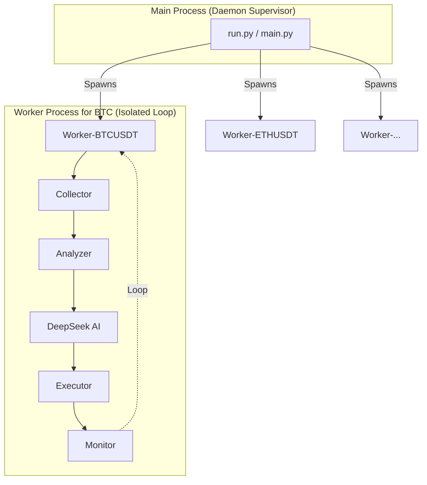

# 🤖 OpenProducer - AI-Powered Algorithmic Trading System


**OpenProducer** - это профессиональная автоматизированная торговая система, разработанная для торговли криптовалютными фьючерсами на бирже **BingX** (Standard & VST Futures).

Система использует передовые модели искусственного интеллекта (**DeepSeek AI**) для принятия торговых решений, комбинируя классический технический анализ с анализом рыночной структуры, психологии толпы и управлением рисками.

---

## 📑 Содержание

1. [⚠️ Важное предупреждение](#warning)
2. [🚀 Ключевые возможности](#features)
3. [🧠 Торговая стратегия и AI](#strategy)
4. [⚙️ Установка и Настройка](#installation)
5. [🔧 Конфигурация (bot_config.json)](#configuration)
6. [🏗️ Архитектура системы](#architecture)
7. [📊 Мониторинг и Логи](#monitoring)
8. [❓ Устранение неполадок](#troubleshooting)

---

## <a id="warning"></a>⚠️ Важное предупреждение

> [!CAUTION]
> **Торговля фьючерсами связана с экстремально высоким риском потери капитала.**
>
> Данное программное обеспечение предоставляется **"КАК ЕСТЬ"** в образовательных целях. Автор не несет ответственности за любые финансовые потери, понесенные в результате использования данного бота.
>
> 1. **ВСЕГДА** начинайте с демо-счета (BingX VST Futures).
> 2. **НИКОГДА** не торгуйте на деньги, которые не можете позволить себе потерять.
> 3. **НЕ ОСТАВЛЯЙТЕ** бота без присмотра на реальном счете на длительное время.

---

## <a id="features"></a>🚀 Ключевые возможности

### 🧠 Интеллектуальный анализ
*   **Dual AI Core**: Поддержка **DeepSeek Official API** и **SiliconFlow API** для максимальной надежности и гибкости.
*   **Психология рынка**: Оценивает, кто контролирует рынок (быки/медведи), ищет признаки "ловушек" и панических продаж.
*   **Smart Sampling**: Умное сжатие исторических данных (до 1000+ свечей) в компактный контекст для ИИ, сохраняя важные экстремумы и объемы.
*   **Smart Skip**: Пропускает очевидно нейтральные рынки (флэт), экономя API токены и снижая шум.

### ⚡ Высокая производительность
*   **True Multiprocessing**: Каждый торговый актив (BTC, ETH и др.) работает в **отдельном изолированном процессе** ОС.
*   **Non-Blocking**: Задержка на одной паре (например, долгий ответ API) **не влияет** на торговлю другими парами.
*   **Continuous Loop**: Каждый воркер работает в собственном бесконечном цикле независимо от остальных.

### 📊 Продвинутая Визуализация
*   **Custom Time Ranges**: Генерация графиков за любой период (1h, 4h, 1D, 1W) с автоматической адаптацией ширины и оси времени.
*   **Smart Indicators**: Корректный расчет SMA и RSI на полном наборе данных, даже для коротких таймфреймов (исключает "плоские" линии).
*   **High-Res Charts**: Детальные свечные графики с наложением индикаторов и торговых уровней.

### 🛡️ Продвинутый Риск-менеджмент
*   **Dynamic SL/TP**: ИИ автоматически рассчитывает уровни Stop Loss и Take Profit на основе локальных уровней поддержки/сопротивления.
*   **Risk/Reward Protection**: Бот **автоматически отклоняет** любые сделки, где потенциальная прибыль меньше риска (R/R < 1.5).

### 📈 Гибкие режимы торговли
*   **Balanced Strategy**: (По умолчанию) Вход по тренду с умеренными рисками. Требуется консенсус трендов (Price vs SMA + EMA crossover).
*   **Aggressive Mode**: Агрессивный режим с расширенными диапазонами RSI (35-70) и опциональным консенсусом трендов. Включает **Momentum Entry** — альтернативный вход по 3+ однонаправленным свечам.
*   **News Filter**: (Опционально) Учитывает новостной фон при принятии решений (требует NewsAPI).

---

## <a id="strategy"></a>🧠 Торговая стратегия: Adaptive Momentum (Breakout & Pullback)

 Система использует адаптивную стратегию, которая автоматически выбирает лучший подход в зависимости от фазы рынка.

 ### 1. Dual Strategy Core
 ИИ анализирует рынок и выбирает один из двух режимов:

 #### 🔥 STRATEGY A: MOMENTUM BREAKOUT (Пробой импульса)
 *Используется, когда рынок летит на высоких объемах.*
 *   **Цель**: Поймать сильное движение (Pump/Dump).
 *   **Логика**: Игнорирует перекупленность RSI, если объем растет. Входит по рынку.

 #### ⚓ STRATEGY B: EMA PULLBACK (Откат к средней)
 *Используется, когда тренд берет паузу (коррекция).*
 *   **Цель**: Купить "дно" локальной коррекции (Buy the Dip).
 *   **Логика**: Ждет касания EMA9/EMA21 на *падающем* объеме и нейтральном RSI.

 ### 2. Profit Maximization ("Let Winners Run")
 Бот запрограммирован **удерживать прибыльные позиции** как можно дольше:
 *   **Low Profit (< 0.5%)**: ЗАПРЕТ на закрытие (HOLD), если структура тренда не сломана.
 *   **Trailing Stop**: При достижении прибыли > 15%, Stop Loss начинает двигаться за ценой, защищая прибыль, но давая сделке расти.

 ### 3. Сбор данных и Фильтры
 *   **Smart Sampling**: Сжимает 720+ свечей в контекст для ИИ.
 *   **Pre-Filters**: Отсеивает "мёртвый" рынок (Volume < 0.3x) и экстремальные риски.

 ### 4. Валидация
 Полученный от ИИ сигнал проходит строгую проверку Risk/Reward (min 1.3 для агрессивного режима).

---

## <a id="installation"></a>⚙️ Установка и Настройка

### Предварительные требования
*   **OS**: Linux (рекомендуется), macOS, Windows (через WSL).
*   **Python**: Версия 3.12 или выше.
*   **Аккаунт BingX**: Для торговли (Standard Futures).

### Пошаговая установка

1.  **Клонируйте репозиторий:**
    ```bash
    git clone https://github.com/xierongchuan/OpenProducer.git
    cd OpenProducer
    ```

2.  **Создайте виртуальное окружение (рекомендуется):**
    ```bash
    python3 -m venv venv
    source venv/bin/activate
    ```

3.  **Установите зависимости:**
    ```bash
    pip install -r requirements.txt
    ```

4.  **Настройте переменные окружения:**
    Создайте файл `.env` в корне проекта:
    ```bash
    touch .env
    ```
    Добавьте в него ваши ключи:
    ```ini
    # BingX API (Standard Futures)
    BINGX_API_KEY="ваш_публичный_ключ"
    BINGX_SECRET_KEY="ваш_секретный_ключ"

    # DeepSeek API (для мозга бота)
    DEEPSEEK_API_KEY="ваш_ключ_deepseek"
    # ИЛИ SiliconFlow API (альтернативный провайдер)
    SILICONFLOW_API_KEY="ваш_ключ_siliconflow"

    # Режим работы
    # "demo" = VST Futures (Виртуальные деньги BingX)
    # "real" = USDT Standard Futures (Реальные деньги)
    MODE="demo"
    ```

5.  **Запустите бота:**
    ```bash
    ./scripts/run_trading_bot.sh
    ```

6.  **Генерация графиков вручную (опционально):**
    Вы можете сгенерировать графики для любого таймфрейма, не запуская весь бот:
    ```bash
    # Графики за последние 2 часа
    python3 src/core/plotter.py 2H

    # Графики за 1 день
    python3 src/core/plotter.py 1D
    ```

---

## <a id="configuration"></a>🔧 Конфигурация (`bot_config.json`)

Файл `bot_config.json` позволяет тонко настроить поведение бота без изменения кода.

```json
{
  "EXCHANGE_SYMBOLS": {
    "bingx": ["ETHUSDT", "LTCUSDT", "XRPUSDT"]
  },
  "AI_SETTINGS": {
    "provider": "siliconflow",
    "model": "deepseek-ai/DeepSeek-V3.2",
    "base_url": "https://api.siliconflow.com/v1/chat/completions"
  },
  "ENABLE_ADVANCED_ANALYSIS": true,
  "ENABLE_PARALLEL_MODE": true,
  "AGGRESSIVE_MODE": true,
  "AGGRESSIVE_SETTINGS": {
    "RSI_BUY_COND": 70,
    "RSI_BUY_FORBIDDEN": 85,
    "RSI_SELL_COND": 30,
    "RSI_SELL_FORBIDDEN": 15,
    "MIN_RISK_REWARD_RATIO": 1.3,
    "MIN_CONFIDENCE": 0.55
  },
  "MOMENTUM_STRATEGY": {
    "enabled": true,
    "atr_sl_multiplier": 1.5,
    "atr_tp_multiplier": 2.5,
    "min_volume_ratio": 0.7,
    "trend_consensus_required": false,
    "momentum_entry_enabled": true,
    "momentum_consecutive_candles": 3
  },
  "ENABLE_NEWS": false,
  "SMART_SAMPLING": {
    "enabled": true,
    "recent_candles": 30,
    "history_step": 10
  },
  "MIN_RISK_REWARD_RATIO": 1.3,
  "POSITION_SIZE_PERCENT": 1.0,
  "LEVERAGE": 20,
  "DEFAULT_PLOTTER_RANGE": "2h"
}
```

### Подробное описание параметров

| Параметр | Тип | Описание | Рекомендация |
| :--- | :--- | :--- | :--- |
| `EXCHANGE_SYMBOLS` | Dict | Список пар для торговли. Должны соответствовать тикерам BingX. | Топ-10 ликвидных |
| `AGGRESSIVE_MODE` | Bool | Включает агрессивную стратегию с Momentum Entry. | `true` |
| `AGGRESSIVE_SETTINGS` | Dict | RSI пороги и MIN_CONFIDENCE для агрессивного режима. | См. пример |
| `MOMENTUM_STRATEGY` | Dict | **NEW**: Настройки Momentum Breakout стратегии. | `enabled: true` |
| `trend_consensus_required` | Bool | Требовать ли совпадение обоих трендов для входа. | `false` (Aggressive) |
| `momentum_entry_enabled` | Bool | Разрешить вход по 3+ однонаправленным свечам. | `true` |
| `min_volume_ratio` | Float | Минимальный объём относительно среднего (0.7 = 70%). | `0.7` |
| `MIN_RISK_REWARD_RATIO` | Float | Минимальное соотношение Прибыль/Риск. | `1.3` (Aggressive) |
| `POSITION_SIZE_PERCENT` | Float | Какой % от баланса использовать в одной сделке. | `1.0` - `5.0` |
| `LEVERAGE` | Int | Кредитное плечо. | `5` - `20` |
| `ENABLE_AI_SKIP_ON_RSI` | Bool | Пропускать ли вызов AI при RSI > 70 или < 30 (экономия токенов). | `true` |

### 🤖 Настройка AI Провайдера

Вы можете выбрать источник API для DeepSeek: официальный API или SiliconFlow.

```json
  "AI_SETTINGS": {
    "provider": "deepseek_official",
    "model": "deepseek-chat",
    "base_url": null
  }
```

*   **provider**: `"deepseek_official"` (по умолчанию) или `"siliconflow"`.
*   **model**: Имя модели (например, `"deepseek-chat"` или `"deepseek-ai/DeepSeek-V3.2"`).
*   **base_url**: Опционально. URL для API запросов (если `null`, используется стандартный URL провайдера).

> [!TIP]
> Для использования SiliconFlow добавьте `SILICONFLOW_API_KEY` в ваш `.env` файл.

---

## <a id="architecture"></a>🏗️ Архитектура системы

Проект перешел на полноценную **мультипроцессную архитектуру**.



*   **Изоляция**: Каждый символ работает в своем процессе.
*   **Независимость**: Падение или задержка на одном символе не влияет на другие.

---

## <a id="monitoring"></a>📊 Мониторинг и Логи

Логи теперь разделены для удобства отладки.

### 1. Логи по символам (`data/logs/*.log`)
Каждая пара пишет свой лог в отдельный файл. Это позволяет легко следить за конкретным активом.

```bash
# Следить только за ETH
tail -f data/logs/ETHUSDT.log
```

### 2. Главный лог (`data/steps.log`)
Общий лог запуска и остановки процессов.

### 3. Торговый лог (`data/trades.log`)
Здесь по-прежнему собирается сводная информация о совершенных сделках для всех пар.

```bash
# В одном окне терминала (лог ETH)
tail -f data/logs/ETHUSDT.log

# В другом окне (лог сделок)
tail -f data/trades.log
```

---

## <a id="troubleshooting"></a>❓ Устранение неполадок

### Бот не открывает сделки
1.  **Проверьте `MIN_RISK_REWARD_RATIO`**: Возможно, ИИ дает сигналы, но они отсеиваются из-за плохого соотношения риска и прибыли. Поищите в логах `[AUTO-FIX: Low R/R]`.
2.  **Проверьте режим**: Если `AGGRESSIVE_MODE: false`, бот ждет очень сильных движений (RSI < 30). Рынок может быть спокойным.
3.  **Проверьте баланс**: На VST счете должны быть средства.

### Ошибка `Signature Validation Failed` (BingX)
*   Проверьте правильность `BINGX_API_KEY` и `BINGX_SECRET_KEY` в `.env`.
*   Убедитесь, что системное время на сервере синхронизировано.

### Ошибка `DeepSeek API Error`
*   Закончились токены на балансе DeepSeek.
*   API недоступен (проверьте статус DeepSeek).

---

## 🤝 Содействие (Contributing)

Мы приветствуем Pull Requests!
1.  Форкните проект.
2.  Создайте ветку (`git checkout -b feature/AmazingFeature`).
3.  Закоммитьте изменения (`git commit -m 'Add some AmazingFeature'`).
4.  Запушьте ветку (`git push origin feature/AmazingFeature`).
5.  Откройте Pull Request.

---

**Happy Trading! 🚀**
