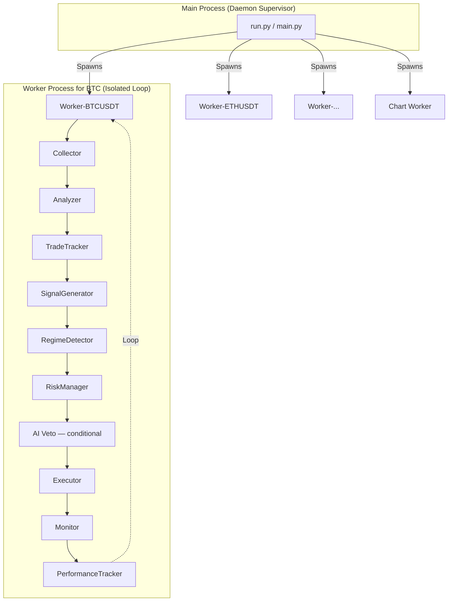

# 🤖 OpenProducer - AI-Powered Algorithmic Trading System


**OpenProducer** - это профессиональная автоматизированная торговая система, разработанная для торговли криптовалютными фьючерсами на бирже **BingX** (Standard & VST Futures).

Система использует передовые модели искусственного интеллекта (**Gemini**, **Claude** и другие через **OpenRouter**) для принятия торговых решений, комбинируя классический технический анализ с анализом рыночной структуры, психологии толпы и управлением рисками.

---

## 📑 Содержание

1. [⚠️ Важное предупреждение](#warning)
2. [🚀 Ключевые возможности](#features)
3. [🧠 Торговая стратегия и AI](#strategy)
4. [⚙️ Установка и Настройка](#installation)
5. [🔧 Конфигурация (bot_config.json)](#configuration)
6. [🏗️ Архитектура системы](#architecture)
7. [📊 Мониторинг и Логи](#monitoring)
8. [❓ Устранение неполадок](#troubleshooting)

---

## <a id="warning"></a>⚠️ Важное предупреждение

> [!CAUTION]
> **Торговля фьючерсами связана с экстремально высоким риском потери капитала.**
>
> Данное программное обеспечение предоставляется **"КАК ЕСТЬ"** в образовательных целях. Автор не несет ответственности за любые финансовые потери, понесенные в результате использования данного бота.
>
> 1. **ВСЕГДА** начинайте с демо-счета (BingX VST Futures).
> 2. **НИКОГДА** не торгуйте на деньги, которые не можете позволить себе потерять.
> 3. **НЕ ОСТАВЛЯЙТЕ** бота без присмотра на реальном счете на длительное время.

---

## <a id="features"></a>🚀 Ключевые возможности

### 🧠 Интеллектуальный анализ
*   **Multi-Model AI Core**: Поддержка **Gemini**, **Claude**, **DeepSeek** и других моделей через единый интерфейс **OpenRouter**. Гибкое переключение между моделями без изменения кода.
*   **Психология рынка**: Оценивает, кто контролирует рынок (быки/медведи), ищет признаки "ловушек" и панических продаж.
*   **Smart Sampling**: Умное сжатие исторических данных (до 1000+ свечей) в компактный контекст для ИИ, сохраняя важные экстремумы и объемы.
*   **Smart Skip**: Пропускает очевидно нейтральные рынки (флэт), экономя API токены и снижая шум.

### ⚡ Высокая производительность
*   **True Multiprocessing**: Каждый торговый актив (BTC, ETH и др.) работает в **отдельном изолированном процессе** ОС.
*   **Smart Economy Filter**: Интеллектуальная система экономии токенов. Бот анализирует рынок локально и **пропускает** вызовы ИИ на "спящем" рынке (низкий объем) или при очевидном флэте, экономя до 30-50% бюджета API.
*   **Dynamic Loop**: Частота анализа адаптируется под выбранный стиль торговли (от 5 секунд для Scalp до 4 часов для Swing).
*   **Continuous Loop**: Каждый воркер работает в собственном бесконечном цикле независимо от остальных.

### 📊 Продвинутая Визуализация
*   **Custom Time Ranges**: Генерация графиков за любой период (1h, 4h, 1D, 1W) с автоматической адаптацией ширины и оси времени.
*   **Smart Indicators**: Корректный расчет SMA и RSI на полном наборе данных, даже для коротких таймфреймов (исключает "плоские" линии).
*   **High-Res Charts**: Детальные свечные графики с наложением индикаторов и торговых уровней.

### 🛡️ Продвинутый Риск-менеджмент
*   **Dynamic SL/TP**: Автоматический расчёт Stop Loss и Take Profit на основе ATR, уровней поддержки/сопротивления и рыночного режима.
*   **Risk/Reward Protection**: Бот **автоматически отклоняет** любые сделки, где потенциальная прибыль меньше риска (R/R < 1.2).
*   **Market Regime Detection**: Автоклассификация рынка (TRENDING/RANGING/VOLATILE/TRANSITIONAL) с адаптацией параметров.
*   **Dynamic Position Sizing**: Автоматический расчёт размера позиции на основе качества сигнала, режима рынка и серии сделок.
*   **Performance Tracking**: Отслеживание win rate, PnL, стриков с автоматическими рекомендациями по калибровке.

### 📈 Гибкие Стили Торговли (Trading Styles)
Переключение режима работы одной строкой конфигурации (`STRATEGY_STYLE`):

| Стиль | Таймфрейм | Цикл | Плечо | Описание |
|-------|-----------|------|-------|----------|
| **SCALP** | 1m | 5 сек | 15x | Тесные стопы, максимальная частота. Сделки длятся минуты |
| **INTRADAY** | 5m | 60 сек | 10x | Баланс скорости и надежности. Сделки внутри дня |
| **SWING** | 1h | 4 часа | 5x | Широкие стопы, контекст 30 дней. Позиции дни/недели |
| **GRID** | 1m | 5 сек | 5x | Сетка лимитных ордеров, заработок на волатильности |
| **HYBRID** (default) | 5m | 60 сек | 10x | Детерминированные сигналы + AI подтверждение |

---

## <a id="strategy"></a>🧠 Торговая стратегия: Adaptive Momentum (Breakout, Pullback & Swing)

Система использует адаптивную стратегию, которая автоматически выбирает лучший подход в зависимости от фазы рынка и выбранного `STRATEGY_STYLE`.

### Три Режима Стратегии

#### 🔥 MOMENTUM BREAKOUT (Пробой импульса) — для SCALP/INTRADAY
*Активируется автоматически на высоких объемах (Volume > 1.2x).*
*   **Цель**: Поймать сильное движение (Pump/Dump).
*   **Логика**: Игнорирует перекупленность RSI, если объем растет.

#### ⚓ EMA PULLBACK (Откат к средней) — для SCALP/INTRADAY
*Активируется на спокойном рынке при падающем объеме.*
*   **Цель**: Купить "дно" локальной коррекции (Buy the Dip).
*   **Логика**: Ждет касания EMA9/EMA21 на *падающем* объеме и нейтральном RSI.

#### 🌊 SWING TRADING (Многодневное удержание) — для SWING
*Активируется, когда `STRATEGY_STYLE` установлен в `"SWING"`.*
*   **Цель**: Захватить глобальные движения на дни и недели.
*   **Логика**: AI инструктируется держать позиции **через ночь (Overnight)**, игнорировать внутридневной шум, фокусироваться на структуре тренда (Higher Highs/Lows).
*   **Стоп-лоссы**: Очень широкие (3x ATR), чтобы позиция не была случайно закрыта.

### Profit Maximization ("Let Winners Run")
*   **Low Profit (< 0.5%)**: ЗАПРЕТ на закрытие (HOLD), если структура тренда не сломана.
*   **Trailing Stop**: При достижении прибыли > 15%, Stop Loss начинает двигаться за ценой.

### Контекст для AI: Исторические Индикаторы
AI получает не просто список свечей, а **полную таблицу с историей индикаторов** для каждой свечи:
`Time | Open | High | Low | Close | Vol | RSI | SMA | SEB_Upper | SEB_Lower | Pattern`
Это позволяет AI видеть, как менялись RSI, SMA и полосы стандартной ошибки (SEB) во времени.

### Фильтры и Экономия
*   **Smart Sampling**: Сжимает 720+ свечей в контекст для ИИ.
*   **Low Volume Skip**: Если объем < 0.4x, бот "спит", не тратя деньги на запросы.

---

## <a id="installation"></a>⚙️ Установка и Настройка

### Предварительные требования
*   **OS**: Linux (рекомендуется), macOS, Windows (через WSL).
*   **Python**: Версия 3.12 или выше.
*   **Аккаунт BingX**: Для торговли (Standard Futures).

### Пошаговая установка

1.  **Клонируйте репозиторий:**
    ```bash
    git clone https://github.com/xierongchuan/OpenProducerBot.git
    cd OpenProducerBot
    ```

2.  **Создайте виртуальное окружение (рекомендуется):**
    ```bash
    python3 -m venv venv
    source venv/bin/activate
    ```

3.  **Установите зависимости:**
    ```bash
    pip install -r requirements.txt
    ```

4.  **Настройте переменные окружения:**
    Создайте файл `.env` в корне проекта:
    ```bash
    touch .env
    ```
    Добавьте в него ваши ключи:
    ```ini
    # BingX API (Standard Futures)
    BINGX_API_KEY="ваш_публичный_ключ"
    BINGX_SECRET_KEY="ваш_секретный_ключ"

    # AI API (OpenRouter)
    OPENROUTER_API_KEY="ваш_ключ_openrouter"      # Gemini, Claude, DeepSeek и другие модели

    # Режим работы
    # "demo" = VST Futures (Виртуальные деньги BingX)
    # "real" = USDT Standard Futures (Реальные деньги)
    MODE="demo"
    ```

5.  **Запустите бота:**
    ```bash
    ./scripts/run_trading_bot.sh
    ```

6.  **Генерация графиков вручную (опционально):**
    Вы можете сгенерировать графики для любого таймфрейма, не запуская весь бот:
    ```bash
    # Графики за последние 2 часа
    python3 src/core/plotter.py 2H

    # Графики за 1 день
    python3 src/core/plotter.py 1D
    ```

---

## <a id="configuration"></a>🔧 Конфигурация (`bot_config.json`)

Файл `bot_config.json` позволяет тонко настроить поведение бота без изменения кода.

```json
{
  "EXCHANGE_SYMBOLS": {
    "bingx": ["BTCUSDT"]
  },
  "STRATEGY_STYLE": "HYBRID",
  "AI_SETTINGS": {
    "provider": "openrouter",
    "model": "google/gemini-2.5-flash",
    "base_url": "https://openrouter.ai/api/v1/chat/completions",
    "temperature": 0.3,
    "max_tokens": 4096,
    "retry_count": 3
  },
  "POSITION_SIZE_PERCENT": 10.0,
  "MIN_RISK_REWARD_RATIO": 1.2,
  "MIN_CONFIDENCE_THRESHOLD": 0.65,
  "ENABLE_ADVANCED_ANALYSIS": true,
  "ENABLE_PARALLEL_MODE": true,
  "AGGRESSIVE_MODE": false,
  "MOMENTUM_STRATEGY": {
    "enabled": true,
    "min_volume_ratio": 0.5,
    "momentum_entry_enabled": true,
    "momentum_consecutive_candles": 3
  },
  "ENABLE_NEWS": false
}
```

### Подробное описание параметров

| Параметр | Тип | Описание | Рекомендация |
| :--- | :--- | :--- | :--- |
| `STRATEGY_STYLE` | Str | **ГЛАВНЫЙ ПАРАМЕТР**: Стиль торговли. Автоматически настраивает таймфреймы, графики, интервалы анализа и AI-инструкции.<br>• `"SCALP"`: 1m свечи, цикл 5 сек, плечо 15x.<br>• `"INTRADAY"`: 5m свечи, цикл 60 сек, плечо 10x.<br>• `"SWING"`: 1h свечи, цикл 4 часа, плечо 5x.<br>• `"GRID"`: 1m свечи, цикл 5 сек, сетка ордеров.<br>• `"HYBRID"`: 5m свечи, цикл 60 сек, детерминированные сигналы + AI. | `HYBRID` |
| `EXCHANGE_SYMBOLS` | Dict | Список пар для торговли. Должны соответствовать тикерам BingX. | Топ-10 ликвидных |
| `POSITION_SIZE_PERCENT` | Float | Процент баланса на одну сделку. | `10.0` |
| `MIN_RISK_REWARD_RATIO` | Float | Минимальное соотношение прибыль/риск для открытия сделки. | `1.2` |
| `AGGRESSIVE_MODE` | Bool | Включает агрессивную стратегию с Momentum Entry. | `false` |
| `MOMENTUM_STRATEGY` | Dict | Настройки Momentum Breakout стратегии (мин. объём, параметры). | `enabled: true` |

### 🤖 Настройка AI Провайдера (`AI_SETTINGS`)

Система работает через **OpenRouter** — единый интерфейс для доступа к различным AI моделям.

```json
"AI_SETTINGS": {
  "provider": "openrouter",
  "model": "google/gemini-2.5-flash",
  "base_url": "https://openrouter.ai/api/v1/chat/completions",
  "temperature": 0.3,
  "max_tokens": 4096,
  "reasoning": {
    "enabled": true,
    "effort": "high",
    "exclude": true
  },
  "retry_count": 3,
  "provider_routing": {
    "allow_fallbacks": true
  },
  "fallback_models": []
}
```

| Параметр | Тип | Описание |
| :--- | :--- | :--- |
| `provider` | Str | Провайдер API: `"openrouter"` |
| `model` | Str | ID модели. Для OpenRouter: `"google/gemini-2.5-flash"`, `"anthropic/claude-sonnet-4"` и др. |
| `base_url` | Str | URL эндпоинта API. Обычно менять не нужно |
| `temperature` | Float | Креативность ответа (0.0–1.0). Для трейдинга лучше 0.2–0.4 |
| `max_tokens` | Int | Максимум токенов в ответе (**включая** reasoning). Для reasoning-моделей нужно 4096+, т.к. reasoning съедает часть лимита |
| **reasoning** | | **Настройки reasoning-моделей** |
| `reasoning.enabled` | Bool | Включить reasoning. `false` — обычная модель без рассуждений |
| `reasoning.effort` | Str | Глубина рассуждений: `"low"`, `"medium"`, `"high"`. Нельзя использовать вместе с `max_tokens` |
| `reasoning.max_tokens` | Int | Лимит токенов на рассуждения (альтернатива `effort`). Нельзя использовать вместе с `effort` |
| `reasoning.exclude` | Bool | **`true`** — рассуждения не попадают в ответ (рекомендуется). `false` — рассуждения включаются в content, съедая лимит `max_tokens` |
| **retry_count** | Int | Количество повторных попыток при ошибках сети/API (502, 429, таймауты). Backoff: 2с, 4с, 8с |
| **provider_routing** | Dict | Настройки роутинга провайдеров (только OpenRouter). Передаётся как `provider` в запросе |
| `provider_routing.allow_fallbacks` | Bool | Разрешить OpenRouter переключаться на другого провайдера при ошибке |
| `provider_routing.ignore` | List | Список провайдеров для игнорирования, например `["ModelRun"]` |
| **fallback_models** | List | Запасные модели. Если основная модель падает, OpenRouter автоматически попробует следующую. Пример: `["deepseek/deepseek-chat"]` |

> [!TIP]
> Укажите `OPENROUTER_API_KEY` в файле `.env`.

> [!WARNING]
> Для reasoning-моделей **обязательно** ставьте `"exclude": true`. Иначе рассуждения попадут в content вместо JSON-ответа и парсинг сломается.

---

## <a id="architecture"></a>🏗️ Архитектура системы

Проект перешел на полноценную **мультипроцессную архитектуру**.



*   **Изоляция**: Каждый символ работает в своем процессе.
*   **Независимость**: Падение или задержка на одном символе не влияет на другие.

---

## <a id="monitoring"></a>📊 Мониторинг и Логи

Логи теперь разделены для удобства отладки.

### 1. Логи по символам (`data/logs/*.log`)
Каждая пара пишет свой лог в отдельный файл. Это позволяет легко следить за конкретным активом.

```bash
# Следить только за ETH
tail -f data/logs/ETHUSDT.log
```

### 2. Главный лог (`data/steps.log`)
Общий лог запуска и остановки процессов.

### 3. Торговый лог (`data/trades.log`)
Здесь по-прежнему собирается сводная информация о совершенных сделках для всех пар.

```bash
# В одном окне терминала (лог ETH)
tail -f data/logs/ETHUSDT.log

# В другом окне (лог сделок)
tail -f data/trades.log
```

---

## <a id="troubleshooting"></a>❓ Устранение неполадок

### Бот не открывает сделки
1.  **Проверьте `MIN_RISK_REWARD_RATIO`**: Возможно, ИИ дает сигналы, но они отсеиваются из-за плохого соотношения риска и прибыли. Поищите в логах `[AUTO-FIX: Low R/R]`.
2.  **Проверьте режим**: Если `AGGRESSIVE_MODE: false`, бот ждет очень сильных движений (RSI < 30). Рынок может быть спокойным.
3.  **Проверьте баланс**: На VST счете должны быть средства.

### Ошибка `Signature Validation Failed` (BingX)
*   Проверьте правильность `BINGX_API_KEY` и `BINGX_SECRET_KEY` в `.env`.
*   Убедитесь, что системное время на сервере синхронизировано.

### Ошибка `AI Provider Error`
*   Закончились кредиты на балансе OpenRouter.
*   API недоступен или модель перегружена (проверьте статус провайдера).

---

## 📱 Telegram Panel

Панель управления ботом через Telegram Mini App. Работает в отдельном контейнере и **не влияет** на работу торгового бота.

### Запуск
```bash
# Запуск панели
podman-compose up --build -d

# Запуск с HTTPS туннелем (для Telegram)
./scripts/start.sh

# Остановка
./scripts/stop.sh
```

### Возможности
*   **Telegram бот**: команды `/start`, `/status`, `/trades`, `/chart`, `/logs`, `/config`, `/help`
*   **Web Dashboard**: React 18 + TypeScript + TailwindCSS
*   **Страницы**: Dashboard, Charts, Trades, Logs, Journal, Settings
*   **Real-time**: WebSocket обновления при изменении данных
*   **Уведомления**: Автоматические алерты при открытии/закрытии сделок

### Настройка
Добавьте в `.env`:
```ini
TELEGRAM_BOT_TOKEN="ваш_токен_бота"
TELEGRAM_ADMIN_ID="ваш_telegram_id"
TELEGRAM_ALLOWED_IDS="id1,id2,id3"    # опционально, для нескольких пользователей
TELEGRAM_PANEL_URL="https://your-domain.com"
```

---

## 📚 Дополнительная документация

*   [Risk Manager](docs/RISK_MANAGER.md) — динамический расчёт SL/TP, адаптивный sizing
*   [Risk Manager Quick Reference](docs/RISK_MANAGER_QUICKREF.md) — краткая справка
*   [Performance Tracking](docs/PERFORMANCE_TRACKING.md) — отслеживание эффективности и калибровка

---

## 🤝 Содействие (Contributing)

Мы приветствуем Pull Requests!
1.  Форкните проект.
2.  Создайте ветку (`git checkout -b feature/AmazingFeature`).
3.  Закоммитьте изменения (`git commit -m 'Add some AmazingFeature'`).
4.  Запушьте ветку (`git push origin feature/AmazingFeature`).
5.  Откройте Pull Request.

---

**Happy Trading! 🚀**
