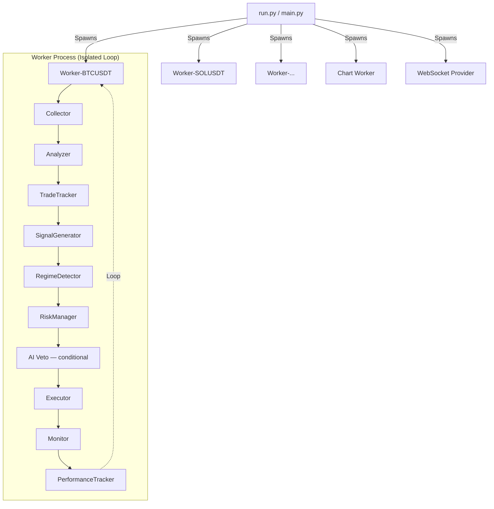

# OpenProducer — AI-Powered Algorithmic Trading System


**OpenProducer** — профессиональная автоматизированная торговая система для торговли криптовалютными фьючерсами на бирже **BingX** (Standard & VST Futures).

Система использует модели искусственного интеллекта (**Gemini**, **Claude**, **DeepSeek** и другие через **OpenRouter**) для принятия торговых решений, комбинируя детерминированный технический анализ с AI-подтверждением, адаптивным риск-менеджментом и многопроцессной архитектурой.

---

## Содержание

1. [Важное предупреждение](#warning)
2. [Ключевые возможности](#features)
3. [Стратегии торговли](#strategies)
4. [Установка и настройка](#installation)
5. [Конфигурация](#configuration)
6. [Архитектура системы](#architecture)
7. [Telegram Panel](#telegram-panel)
8. [Мониторинг и логи](#monitoring)
9. [Устранение неполадок](#troubleshooting)

---

## <a id="warning"></a>Важное предупреждение

> [!CAUTION]
> **Торговля фьючерсами связана с экстремально высоким риском потери капитала.**
>
> Данное программное обеспечение предоставляется **"КАК ЕСТЬ"** в образовательных целях. Автор не несет ответственности за любые финансовые потери, понесенные в результате использования данного бота.
>
> 1. **ВСЕГДА** начинайте с демо-счета (BingX VST Futures).
> 2. **НИКОГДА** не торгуйте на деньги, которые не можете позволить себе потерять.
> 3. **НЕ ОСТАВЛЯЙТЕ** бота без присмотра на реальном счете на длительное время.

---

## <a id="features"></a>Ключевые возможности

### Интеллектуальный анализ
- **Multi-Model AI Core**: Поддержка Gemini, Claude, DeepSeek и других моделей через единый интерфейс OpenRouter.
- **Детерминированные сигналы + AI**: В режиме HYBRID/AISCALP сигналы генерируются математически (scoring system), AI лишь подтверждает или отклоняет.
- **Market Regime Detection**: Автоклассификация рынка (TRENDING / RANGING / VOLATILE / TRANSITIONAL) с адаптацией всех параметров.
- **Multi-Timeframe Analysis**: AISCALP стратегия использует HTF (1H) для определения глобального тренда и сессионную фильтрацию.
- **Smart Sampling**: Сжатие исторических данных для AI-контекста с сохранением экстремумов.

### Высокая производительность
- **True Multiprocessing**: Каждый торговый актив работает в отдельном изолированном процессе ОС.
- **WebSocket Cache**: Опциональный реальном-время кэш свечей через WebSocket с автоматическим fallback на REST.
- **Hot-Reload Config**: `config/active.json` и `config/trading.json` проверяются каждые 30 секунд, изменения применяются без перезапуска.
- **Dynamic Loop**: Частота анализа адаптируется под стиль (1.5s SCALP → 60s AISCALP → 4h SWING).

### Продвинутый риск-менеджмент
- **Dynamic SL/TP**: Расчёт на основе ATR + уровни поддержки/сопротивления + рыночный режим + качество сигнала.
- **Fee-Adjusted R/R**: Валидация risk/reward с учётом комиссий (maker/taker).
- **Dynamic Position Sizing**: Размер позиции от 3% до 20% баланса на основе quality/regime/streak.
- **Performance Tracking**: Отслеживание win rate, PnL, стриков по режимам с автоматическими рекомендациями по калибровке.

### Визуализация
- **12 временных диапазонов**: От 15 минут до 14 дней.
- **Параллельная генерация**: Графики создаются в отдельном процессе через ProcessPoolExecutor.
- **Индикаторы на графиках**: Candlestick + SMA (10/20/50/100/200) + RSI + SEB + позиция + SL/TP.

---

## <a id="strategies"></a>Стратегии торговли

Переключение стиля в `config/active.json` → `strategy`:

| Стиль | Таймфрейм | Цикл | Плечо | Описание |
|-------|-----------|------|-------|----------|
| **SCALP** | 1m | 1.5s | 15x | Dual-loop движок (быстрый 1.5s + медленный 45s). Trailing stops, breakeven, time exits. OB imbalance + VWAP. Max hold: 15 мин |
| **AISCALP** | 1m | 60s | 10x | Multi-TF анализ (1m + 1H). Сессионная фильтрация (ASIAN/EUROPEAN/US). HTF trend alignment. 4-12 часов |
| **SWING** | 1h | 4h | 5x | Многодневное удержание (2-14 дней). Min hold 24h, cooldown 6h. Milestone exits. Широкие стопы (3x ATR) |
| **GRID** | 1m | 5s | 5x | Сетка лимитных ордеров. Inventory management. ADX-based pause при сильном тренде |
| **HYBRID** | 5m | 60s | 10x | Детерминированные сигналы (scoring 0-10) + AI подтверждение. Авто-выполнение при quality >= 0.7, AI veto для borderline |
| **MACDX** | 15m | 60s | 10x | **Без AI** — чистый MACD crossover с 3-5 подтверждениями. Полностью детерминированное выполнение |

### Система скоринга сигналов (HYBRID/AISCALP)

**Tier 1 — Направление** (обязательно хотя бы один):
- EMA alignment (+2): ema9 > ema21 → LONG, ema9 < ema21 → SHORT
- MACD crossover (+1): линия выше сигнала + гистограмма > 0

**Tier 2 — Подтверждение** (обязательно хотя бы один):
- RSI zone (+2): Long [20-43], Short [57-80]
- S/R proximity (+2): Поддержка/сопротивление в пределах 2-3%

**Tier 3 — Поддержка** (опционально):
- Momentum (+1), Bollinger Bands (+1), Volume (+1)

**Бонусы/штрафы**: EMA+MACD confluence (+1), Reversal confluence (+2), RSI divergence (-2)

### Система скоринга MACDX (без AI)

Стратегия **MACDX** работает полностью без AI. Все решения принимаются детерминированно на основе MACD crossover с подтверждениями.

**Обязательный сигнал** (без него — HOLD):
- MACD Crossover (+2): Линия MACD пересекает сигнальную линию

**Подтверждения** (минимум 3 из 5 для открытия):
| Индикатор | Вес | Условие |
|-----------|-----|---------|
| RSI Zone | +2 | Long: RSI в [25-65], Short: RSI в [35-75] |
| EMA Alignment | +2 | Long: EMA9 > EMA21, Short: EMA9 < EMA21 |
| Not Sideways | +1 | BB width > 0.5% ИЛИ ADX > 20 |
| No Exhaustion | +1 | Нет RSI-дивергенции против направления |
| Volume | +1 | Volume ratio >= 0.5 |

**Требования**: Max score = 9, Min score = 4, Min confirmations = 3

**Условия выхода**:
- MACD гистограмма разворачивается против позиции
- RSI достигает экстремума (>80 для long, <20 для short)
- Take profit при хорошем PnL с угасанием моментума

### Рыночные режимы

Автоматическая классификация на основе EMA spread, BB width percentile, ATR ratio:

| Режим | Min Score | SL Mult | TP Mult | Sizing |
|-------|-----------|---------|---------|--------|
| TRENDING | 4 | 1.5x | 3.5x | 1.2x |
| RANGING | 5 | 1.0x | 2.0x | 0.8x |
| VOLATILE | 5 | 2.0x | 3.5x | 0.6x |
| TRANSITIONAL | 5 | 2.0x | 3.0x | 0.7x |

---

## <a id="installation"></a>Установка и настройка

### Предварительные требования
- **OS**: Linux (рекомендуется), macOS, Windows (через WSL)
- **Python**: 3.12+
- **Podman** или **Docker**: Для контейнерного запуска (рекомендуется)
- **Аккаунт BingX**: Для торговли (Standard Futures)
- **OpenRouter API key**: Для AI-анализа

### Установка

1. **Клонируйте репозиторий:**
    ```bash
    git clone https://github.com/yourusername/OpenProducerBot.git
    cd OpenProducerBot
    ```

2. **Настройте переменные окружения:**
    ```bash
    cp .env.example .env
    ```
    Заполните `.env`:
    ```ini
    # Режим работы: demo (VST) или real
    MODE=demo
    EXCHANGE=bingx

    # AI API (OpenRouter)
    OPENROUTER_API_KEY=sk-your-key-here

    # BingX API
    BINGX_API_KEY=your_api_key
    BINGX_SECRET_KEY=your_secret_key

    # Telegram Panel (опционально)
    TELEGRAM_BOT_TOKEN=your_bot_token
    TELEGRAM_ADMIN_ID=your_telegram_id
    ```

3. **Запустите бота:**
    ```bash
    ./scripts/run_trading_bot.sh
    ```

    Скрипт автоматически соберёт Docker-образ с зависимостями и запустит бота в контейнере.

### Генерация графиков (опционально)

```bash
python3 src/core/plotter.py 2H    # за 2 часа
python3 src/core/plotter.py 1D    # за 1 день
python3 src/core/plotter.py 1W    # за 1 неделю
```

---

## <a id="configuration"></a>Конфигурация (`config/`)

Система использует модульную структуру конфигурации:

```
config/
  base.json           # Инфраструктура (биржа, AI, чарты) — редко меняется
  trading.json        # Торговые параметры (позиция, риски, фичи)
  strategies/         # Настройки стратегий
    scalp.json, aiscalp.json, swing.json, grid.json, hybrid.json, macdx.json
  profiles/           # Per-symbol переопределения
    default.json, btc_aggressive.json, eth_conservative.json
  active.json         # Активная стратегия + символы + профили
```

### `config/active.json` — Текущие настройки

```json
{
  "strategy": "MACDX",
  "symbols": { "bingx": ["BTC-USDT", "ETH-USDT"] },
  "disabled_symbols": []
}
```

### `config/trading.json` — Торговые параметры

| Параметр | Путь | Описание | По умолчанию |
|----------|------|----------|:------------:|
| Position size | `position.size_percent` | % баланса на сделку | `10` |
| Min trade | `position.min_trade_amount_usdt` | Мин. сумма USDT | `10` |
| Confidence | `risk.min_confidence_threshold` | Мин. AI confidence | `0.55` |
| R/R ratio | `risk.min_risk_reward_ratio` | Мин. Risk/Reward | `1.2` |
| Take profit | `risk.take_profit_percent` | TP в % | `2.5` |
| Stop loss | `risk.stop_loss_percent` | SL в % | `1.0` |

### `config/base.json` — AI Настройки (`ai`)

```json
{
  "provider": "openrouter",
  "model": "google/gemini-3-flash-preview",
  "temperature": 0.3,
  "max_tokens": 4096,
  "reasoning": { "enabled": true, "effort": "medium", "exclude": true }
}
```

> [!TIP]
> Укажите `OPENROUTER_API_KEY` в файле `.env`.

> [!WARNING]
> Для reasoning-моделей **обязательно** ставьте `"exclude": true`. Иначе рассуждения попадут в content вместо JSON-ответа и парсинг сломается.

### Стилевые пресеты (`config/strategies/*.json`)

Каждый стиль автоматически настраивает: `timeframe`, `loop_interval`, `position_check_interval`, `atr_sl_mult`, `atr_tp_mult`, `leverage`.

Дополнительные параметры:
- **SCALP**: `loops.fast_interval` (1.5s), `loops.slow_interval` (45s), `time_exit.max_hold_minutes` (15), `breakeven`, `trailing`
- **AISCALP**: `htf_timeframe` (1h), session-based filtering, `pre_filter` (skip dead markets)
- **SWING**: `min_hold_hours` (24), `cooldown_after_close_hours` (6)
- **GRID**: `grid_levels` (5), `grid_spacing_pct` (0.3%), `inventory_limit`, `emergency_stop_loss_pct`
- **MACDX**: `signal_rules` — веса индикаторов, пороги RSI, min_score, min_confirmations

### Hot-Reload

Изменения в `config/active.json` и `config/trading.json` подхватываются автоматически каждые 30 секунд. Для `config/base.json` и файлов стратегий требуется перезапуск.

---

## <a id="architecture"></a>Архитектура системы

**Мультипроцессная архитектура** — каждый символ работает в изолированном процессе ОС.



### Ключевые модули

```
src/
├── core/                           # Торговое ядро
│   ├── process_worker.py           # Оркестратор цикла (per-symbol)
│   ├── collector.py                # Сбор OHLCV данных
│   ├── analyzer.py                 # Технический анализ (EMA, RSI, MACD, ATR, BB, SEB, S/R)
│   ├── signal_generator.py         # Детерминированный скоринг (HYBRID)
│   ├── aiscalp_signal.py           # Multi-TF скоринг (AISCALP)
│   ├── macdx_signal.py             # MACD crossover скоринг (MACDX) — без AI
│   ├── scalp_engine.py             # Dual-loop движок (SCALP)
│   ├── scalp_signal.py             # Скоринг с OB/VWAP (SCALP)
│   ├── regime.py                   # Детектор рыночного режима
│   ├── risk_manager.py             # Dynamic SL/TP + позиционный sizing
│   ├── predict.py                  # LLM вызовы + smart filter
│   ├── executor.py                 # Размещение ордеров
│   ├── monitor.py                  # Мониторинг позиций
│   ├── trade_tracker.py            # Персистенция сделок (JSON)
│   ├── decision_journal.py         # Журнал AI-решений + cooldown
│   ├── performance.py              # Отслеживание эффективности + калибровка
│   ├── plotter.py                  # Генерация графиков (matplotlib)
│   ├── chart_worker.py             # Параллельная генерация (ProcessPoolExecutor)
│   ├── grid_worker.py              # Grid стратегия (воркер)
│   └── grid_executor.py            # Grid стратегия (ордера)
├── exchanges/                      # Слой биржи
│   ├── exchange_client.py          # Абстрактный интерфейс
│   ├── bingx_client.py             # BingX реализация (HMAC-SHA256)
│   ├── exchange_factory.py         # Factory pattern
│   └── ws_data_provider.py         # WebSocket кэш свечей
├── prompts/                        # AI промпт система
│   ├── builder.py                  # Модульная сборка промптов
│   ├── blocks/                     # Текстовые блоки (10 файлов)
│   └── strategies/                 # 10 стратегий (Scalp/AiScalp/Swing/Grid/Hybrid/MACDX + варианты)
├── utils/                          # Утилиты
│   ├── logger.py                   # Логирование (per-symbol + StageTimer)
│   ├── helpers.py                  # Вспомогательные функции
│   ├── news_api.py                 # Новости (NewsAPI/AlphaVantage/Finnhub)
│   └── cleanup_cache.py            # Очистка кэша
├── telegram_panel/                 # Панель управления
│   ├── run_panel.py                # FastAPI + Telegram Bot
│   ├── bot.py                      # Telegram команды + уведомления
│   ├── backend/                    # FastAPI API (REST + WebSocket)
│   └── frontend/                   # React 18 + TypeScript + TailwindCSS
└── config.py                       # Загрузчик конфигурации + hot-reload
```

---

## <a id="telegram-panel"></a>Telegram Panel

Панель управления ботом через Telegram Mini App. Работает в отдельном контейнере и **не влияет** на работу торгового бота.

### Запуск

```bash
# Интерактивный запуск (выбор режима: ngrok / tunnel / prod)
./scripts/start_panel.sh

# Или с указанием режима
./scripts/start_panel.sh ngrok     # локальная разработка через ngrok
./scripts/start_panel.sh tunnel    # VPS tunnel через SSH + cloudflared
./scripts/start_panel.sh prod      # URL уже задан в .env

# Остановка
./scripts/stop_panel.sh
```

### Возможности

**Telegram Bot** — команды:
- `/start` — Приветствие + кнопка Mini App
- `/status` — Стратегия, активные позиции, символы
- `/trades` — Список сделок с PnL, ROE%, комиссиями
- `/chart` — Последний сгенерированный график
- `/logs` — Последние строки системных логов
- `/config` — Сводка конфигурации
- `/help` — Все доступные команды

**Web Dashboard** (React Mini App):
- **Dashboard** — обзор активных позиций и стратегии
- **Trades** — история сделок с фильтрами, статистика (win rate, total PnL, fees)
- **Charts** — галерея PNG графиков (auto-update)
- **Logs** — просмотр логов в реальном времени
- **Journal** — журнал AI-решений
- **Settings** — редактор конфигурации

**Real-time**: WebSocket обновления при изменении файлов данных.
**Уведомления**: Автоматические алерты при открытии/закрытии сделок.
**Аутентификация**: Telegram HMAC initData + whitelist user IDs.

### Настройка

Добавьте в `.env`:
```ini
TELEGRAM_BOT_TOKEN=your_bot_token
TELEGRAM_ADMIN_ID=your_telegram_id
TELEGRAM_ALLOWED_IDS=id1,id2,id3          # опционально
TELEGRAM_PANEL_URL=https://your-domain.com  # для prod режима
PANEL_PORT=8080
```

---

## <a id="monitoring"></a>Мониторинг и логи

### Логи по символам (`data/logs/*.log`)

Каждая торговая пара пишет лог в отдельный файл:

```bash
tail -f data/logs/BTCUSDT.log
```

### Главный лог (`data/steps.log`)

Общий лог запуска, остановки процессов и системных событий.

### Торговый лог (`data/trades.log`)

Сводная информация о совершённых сделках для всех пар.

### Данные (data/)

| Файл | Описание |
|------|----------|
| `active_trades.json` | Открытые позиции (с entry regime/score/quality) |
| `trade_history.json` | Закрытые сделки (с net PnL и fees) |
| `decision_journal.json` | История AI-решений, trade plans, cooldowns |
| `calibration_suggestions.json` | Рекомендации по калибровке от PerformanceTracker |
| `prices/{SYMBOL}.json` | Кэш OHLCV свечей |
| `news/{SYMBOL}.json` | Кэш новостей |

```bash
# Мониторинг в реальном времени
./scripts/monitor_logs.sh

# Или вручную
tail -f data/logs/BTCUSDT.log   # конкретная пара
tail -f data/trades.log          # все сделки
```

---

## <a id="troubleshooting"></a>Устранение неполадок

### Бот не открывает сделки
1. **Проверьте `MIN_RISK_REWARD_RATIO`**: Сигналы могут отсеиваться из-за плохого R/R. Ищите в логах `[AUTO-FIX: Low R/R]`.
2. **Проверьте `MIN_CONFIDENCE_THRESHOLD`**: AI может давать low-confidence ответы. Текущий порог: 0.55.
3. **Проверьте режим рынка**: В RANGING/VOLATILE режимах min_score повышается (5-7).
4. **Проверьте `DISABLED_SYMBOLS`**: Символ может быть заблокирован.
5. **Проверьте баланс**: На VST счете должны быть средства.

### Ошибка `Signature Validation Failed` (BingX)
- Проверьте `BINGX_API_KEY` и `BINGX_SECRET_KEY` в `.env`.
- Убедитесь, что системное время синхронизировано (NTP).

### Ошибка `AI Provider Error`
- Закончились кредиты на балансе OpenRouter.
- API недоступен или модель перегружена.
- Проверьте `request_timeout` (по умолчанию 60 секунд).
- Настройте `fallback_models` для автоматического переключения.

### Проблемы с Telegram Panel
- Убедитесь что `TELEGRAM_BOT_TOKEN` задан в `.env`.
- Проверьте что `TELEGRAM_ADMIN_ID` или `TELEGRAM_ALLOWED_IDS` настроены.
- Логи: `podman-compose logs -f`

---

## Contributing

Мы приветствуем Pull Requests!

1. Форкните проект
2. Создайте ветку (`git checkout -b feature/AmazingFeature`)
3. Закоммитьте изменения (`git commit -m 'feat: add AmazingFeature'`)
4. Запушьте ветку (`git push origin feature/AmazingFeature`)
5. Откройте Pull Request

**Commit style**: `feat:`, `fix:`, `test:`, `chore:`, `refactor:`

---

## Лицензия

**Strict Proprietary Software License.** Все права защищены.

Данное программное обеспечение является собственностью [https://github.com/xierongchuan](https://github.com/xierongchuan). Использование, копирование, модификация или распространение без письменного разрешения правообладателя запрещено.

См. файл [LICENSE.md](LICENSE.md) для получения полной информации.
